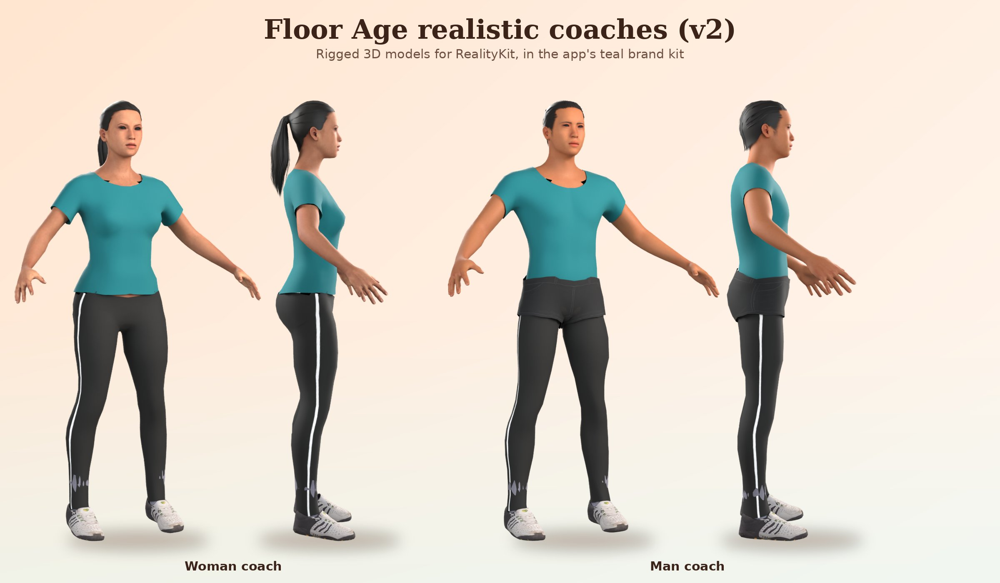

# Floor Age

**How old does your body move?** An iOS fitness app built around one number, your *Floor Age*. It comes from four simple at-home tests: sit to rise from the floor, one-leg balance, a 30-second chair stand and a toe reach. A 3D coach demonstrates every move and talks you through daily sessions that target your weakest area. Everything runs on the phone: no account, no server and no running costs.

## What's in the app

- **3D coach avatar** (RealityKit). A realistic woman or man, matching the gender in your profile, demonstrates each exercise. Drag to turn it, pinch to zoom, double-tap to reset. Settings can switch to a friendly cartoon coach instead.
- **Demo videos.** A "Watch a real demo" clip for each exercise, bundled in the app and played offline.
- **Voice coaching** using the iPhone's built-in voices (Indian English by default). It works offline, ducks your music, and still speaks when the phone is on silent.
- **Floor Age check.** Four guided tests produce an estimated "equivalent age" for each area and overall.
- **Camera scoring and your 3D twin.** Prop the phone up 2–3 m away, and the front camera counts chair stands, starts and stops the balance timer and suggests how far you reached. Meanwhile, the realistic 3D coach copies your movements like a mirror: it sits on the chair when you sit, lifts its foot when you do, and folds when you fold. A small picture in the corner shows the camera with your body outline, so you can check you're in view. It uses Apple's on-device body pose detection (Vision); frames are analysed and discarded, never recorded. Sit to rise is still entered by hand, because a hand or knee touching the floor is too easy to miss from one camera. You can always correct the numbers.
- **Share card.** A story-sized picture of your Floor Age and areas with a challenge ("Can you get up off the floor without using your hands?") and, once the app is live, a QR code to the App Store. You can hide your real age before sharing, and it never shows your name.
- **Family profiles (Plus).** Test and coach parents or a partner on the same iPhone, each with their own Floor Age, plan and history. Switch with the avatar at the top of Today. Steps, Apple Health sleep and reminders stay with the phone's owner, because they come from this iPhone.
- **Daily plan.** About 10 minutes: a warm-up plus exercises for your weakest areas, finishing with pelvic floor (Kegel) squeezes. Moves are skipped or adapted for knee, hip or back problems.
- **Pelvic floor.** Guided Kegel squeezes with "Squeeze and lift… And relax" timing, at the end of each plan (can be switched off) or as a 2-minute session from Today.
- **Consistency tracking.** Shows how many of the last 7 days you trained. Missing a day never resets your progress.
- **Track tab:**
  - **Steps:** today's steps against a goal you set, distance, and a 7-day chart, from the iPhone's own motion sensors (CoreMotion, Motion & Fitness permission). No account or HealthKit needed.
  - **Calories:** log meals from about 75 common Indian foods with typical portions, or add your own. **Snap your plate** takes a photo and suggests what's on it using Apple's on-device image classifier (it knows dishes like biryani, curry, naan, samosa, rice and raita, plus fruit and drinks). You tick the right items and set the servings, because no photo can show portion size. The photo never leaves the phone. The daily target comes from the Mifflin-St Jeor formula for your age, gender, height and weight.
  - **BMI:** height (cm or ft/in) and weight, a colour-coded result with encouragement, your healthy weight range, and a weight chart. It uses the lower BMI cut-offs recommended for South Asians (healthy 18.5–22.9).
- **Evening reminder.** Optional, at a time you pick (6 pm by default). One notification a day, only if you haven't done that day's training, naming what's planned. None on rest days.
- **Training plan.** Chosen from your BMI, age and limitations:
  - **Couch to 5K run/walk:** a healthy weight, under 60, no joint limits.
  - **Brisk walking:** overweight or underweight, 60+, or knee or hip problems.
  - **Gentle walking:** obese, 70+, or a doctor's limit.

  Each week has run/walk intervals or walking minutes, strength days with sets × reps, balance days from 65, and a daily step goal. A guided timer talks you through each run/walk. The numbers follow WHO 2020, NHS Couch to 5K, ACSM 2009 and Paluch et al. 2022 (listed in the app).
- **Sleep.** Log bedtime and wake time, or read them from Apple Health, and compare with the recommended 7–9 hours (7–8 from 65; National Sleep Foundation).
- **Editable profile.** Change your age or limitations in Settings. Your plan and safety filtering update right away.
- **Floor Age Plus.** A free download with one optional in-app purchase, no subscription. Plus unlocks the training plan, family profiles, food photo calories, sleep tracking, the pelvic floor programme and the Floor Age history chart. The Floor Age check, daily sessions with the coach, steps, calories, BMI and all safety guidance stay free. See [Floor Age Plus](#floor-age-plus-in-app-purchase).
- **Privacy.** Everything is stored on the phone. Nothing is sent anywhere except the Plus purchase itself, which goes through Apple.
- **Languages.** English (default), Hindi and Spanish, following the iPhone's language. Screens, spoken coaching (in the matching iPhone voice), exercise instructions and food names are all translated.
- **Look.** A warm, slowly drifting gradient behind every screen and the 3D coach standing right on the background. Each area has its own colours: orange steps, green calories, violet BMI, midnight sleep, ocean-blue plan, amber Floor Age. Headline numbers sit on gradient hero cards with semicircle gauges, and headings use a serif display face.

## Repository layout

| Path | What it is |
|---|---|
| `project.yml` | XcodeGen spec. The `.xcodeproj` is generated from it and not committed. |
| `FloorAge/` | SwiftUI app source (iOS 18+) |
| `FloorAge/Resources/exercises.json` | Avatar skeleton, poses and the exercise library (keyframes, cues, rep timing) |
| `FloorAge/Resources/Videos/` | Demo clips, `demo_<exercise id>.mp4` (see [Demo videos](#demo-videos)) |
| `FloorAgeTests/` | Unit tests: scoring, plan safety filtering, persistence, exercise data, pose solver, reminders |
| `tools/pose_preview.py` | Renders stick-figure previews of every exercise from `exercises.json` (no Mac needed) |
| `tools/build_coach.py` | Builds the realistic coach models `FloorAge/Resources/coach_*.usdz` in Blender (see [Realistic coach](#realistic-coach)) |
| `.github/workflows/ios-build.yml` | Builds on GitHub's macOS machines on every push, plus simulator screenshots |
| `.github/workflows/testflight.yml` | Manually triggered signed build uploaded to TestFlight |

## Building without a Mac

Every push to `main` builds the app on GitHub Actions (`macos-26`), runs the unit tests, and uploads simulator screenshots of the coach as an artifact (**Actions → iOS build → Artifacts**).

### Put a build on your iPhone (TestFlight)

One-time setup:

1. **Register the bundle ID.** At developer.apple.com go to **Certificates, IDs & Profiles → Identifiers → +** and choose **App IDs** with the explicit ID `com.jeyaraj.floorage`. To use a different ID, change `PRODUCT_BUNDLE_IDENTIFIER` in `project.yml` and the ID in `ios-build.yml`.
2. **Create the app.** In App Store Connect go to **Apps → + → New App**, pick that bundle ID and name it (the name must be unique on the App Store).
3. **Create an API key.** In App Store Connect go to **Users and Access → Integrations → App Store Connect API → +** and give it the **Admin** role, which cloud signing needs. Download the `.p8` file (you can only download it once) and note the Key ID and Issuer ID.
4. **Add the secrets.** In GitHub go to **Settings → Secrets and variables → Actions** and add:
   - `APPLE_TEAM_ID` from developer.apple.com → Membership
   - `ASC_KEY_ID` and `ASC_ISSUER_ID`
   - `ASC_KEY_P8`: paste the whole contents of the `.p8` file

The app reads sleep from Apple Health, so the bundle ID needs the **HealthKit** capability. Automatic signing usually turns it on. If the TestFlight build fails with a HealthKit provisioning error, tick HealthKit for the identifier at developer.apple.com. The App Store also asks for a privacy policy for apps that use Health data.

Then open **Actions → TestFlight → Run workflow**. When App Store Connect finishes processing (usually 5–15 min), the build appears in the TestFlight app on your iPhone.

### On a Mac (optional)

```bash
brew install xcodegen
xcodegen generate
open FloorAge.xcodeproj
```

Pick your team under **Signing & Capabilities** and run on the simulator or a plugged-in iPhone. Run the unit tests with **Product → Test** (⌘U) or:

```bash
xcodebuild test -project FloorAge.xcodeproj -scheme FloorAge -destination 'platform=iOS Simulator,name=iPhone 17'
```

## Editing exercises

Poses live in `FloorAge/Resources/exercises.json`. Joint angles are in degrees, applied Y (twist), then Z (sideways), then X (forward/back). Each keyframe says what touches the floor (`feet`, `left`, `right`, `seat`, `lowest`), and the solver keeps that contact planted. Preview changes on any computer:

```bash
python tools/pose_preview.py            # every exercise -> tools/out/<id>.png
python tools/pose_preview.py squat      # just one
```

## Demo videos

Each exercise can have a short real-person demo clip next to the 3D coach. Clips are bundled in the app, so they play offline and cost nothing to host.

- Put them in `FloorAge/Resources/Videos/` named `demo_<exercise id>.mp4`, for example `demo_squat.mp4`. The IDs are in `exercises.json`.
- Run `xcodegen generate` after adding or removing a clip.
- An exercise without a clip shows no video button, so you can add clips one at a time. A unit test flags clips that don't match an exercise ID.
- The current clips are stick-figure **placeholders** generated from the poses. Replace them before release.
- Tips for filming: landscape or portrait both work. Keep each clip to 5–15 seconds of one clean, looping rep (it loops automatically), under about 5 MB (1080p H.264). Show the easier version if there is one, and film near a wall or chair where the safety note says to use one.

## Realistic coach

The realistic coaches (`FloorAge/Resources/coach_female.usdz`, `coach_male.usdz`) are made with [MakeHuman](http://www.makehumancommunity.org) via its Blender add-on MPFB. Everything exported comes from CC0 asset packs, so it's free to ship. The app poses their skeleton from the same `exercises.json` keyframes as the cartoon coach (`FloorAge/Avatar/RealisticCoach.swift`).



The v2 coaches are South Asian adults in their early 30s wearing the app's teal training kit: a tee over black running tights, and the man also wears charcoal shorts. To change a coach's look (body shape, skin, hair, clothes, brand recolouring), edit `COACHES` in `tools/build_coach.py` and rebuild (Blender 4.2+ on macOS or Linux). Set `PREVIEW=<dir>` to also render studio previews:

1. Install Blender 4.2+ and the MPFB extension (extensions.blender.org/add-ons/mpfb).
2. Load the CC0 packs `makehuman_system_assets`, `skins01`, `skins02`, `hair01`, `shirts01`, `pants01` and `shoes01` from the [asset packs page](https://static.makehumancommunity.org/assets/assetpacks/index.html) into MPFB.
3. Run `blender -b --python tools/build_coach.py -- FloorAge/Resources`, then `xcodegen generate`.

## App Store listing

The listing lives in `fastlane/metadata/` (English, Hindi, and Spanish for Mexico and Spain), ready to upload with `fastlane deliver` or to paste into App Store Connect. `python3 tools/check_appstore_metadata.py` checks the character limits. `AppStore/LISTING.md` covers:
- the privacy and age-rating answers;
- in-app purchase text;
- App Review notes;
- the screenshot plan and preview video storyboard;
- a launch checklist.

`AppStore/privacy.html` and `AppStore/support.html` are the privacy policy and support pages to publish (for example with GitHub Pages).

## Floor Age Plus (in-app purchase)

Plus is one **non-consumable** in-app purchase, handled on the phone by StoreKit 2 (`Models/Store.swift`, screen in `Features/Plus/PlusView.swift`). There is no server; Apple signs and checks the transactions.

To sell it:
1. In App Store Connect, sign the **Paid Apps Agreement** and add your bank and tax details (Business section).
2. Optionally join the **App Store Small Business Program**, which lowers Apple's commission from 30% to 15%.
3. In the app's page, under Monetization › In-App Purchases, create a **Non-Consumable** with product ID `com.jeyaraj.floorage.plus` (must match `Store.plusID`). Give it a display name and description for each language, a price, and a review screenshot of the Plus screen. Turn on Family Sharing if you want families to share it.
4. Submit the in-app purchase together with the next app version.

To test without real money:
- **In Xcode:** the FloorAge scheme uses `FloorAge.storekit`, so Run lets you buy, refund and restore Plus locally.
- **On a device:** use a Sandbox Apple Account (App Store Connect › Users and Access › Sandbox) through TestFlight.

For screenshots, demo screens show Plus unlocked. Add `-demoPlus NO` to show the locked cards, and use `-demoScreen plus` to open the Plus screen.

When adding a feature, decide whether it's free or Plus. If it's Plus, add it to `PlusFeature` and show `PlusLockedCard` when `store.hasPlus` is false. Safety guidance always stays free.

## Translations

English is the development language, with Hindi (`hi`) and Spanish (`es`) in String Catalogs in `FloorAge/Resources`:

| Catalog | What it holds |
|---|---|
| `Localizable.xcstrings` | Screen text and spoken lines, extracted from the code automatically. Wrap text built in code in `String(localized:)`. |
| `InfoPlist.xcstrings` | The permission prompts. |
| `Exercises.xcstrings` | Exercise names, instructions, cues and safety notes, keyed `<exercise id>.name`, `.intro`, `.cue.0`, `.safety`. |
| `Foods.xcstrings` | Food names and servings, keyed by the English name. |

The translations were machine-assisted. **Have a native speaker review the Hindi and Spanish, especially the safety wording**, before release. `python3 tools/check_translations.py` (also run in CI) fails if a string is missing a translation or a placeholder like `%lld` doesn't match. To try a language, set the app's language in iPhone Settings › Floor Age › Language.

## Floor Age scoring

Each test result maps to an "equivalent age" by interpolating along approximate age norms from published reference data. The sources are in `FloorAge/Models/FloorAge.swift`. The overall Floor Age is a weighted average. It is a **fitness estimate, not a medical diagnosis**, and the norms should be refined with real user data.
